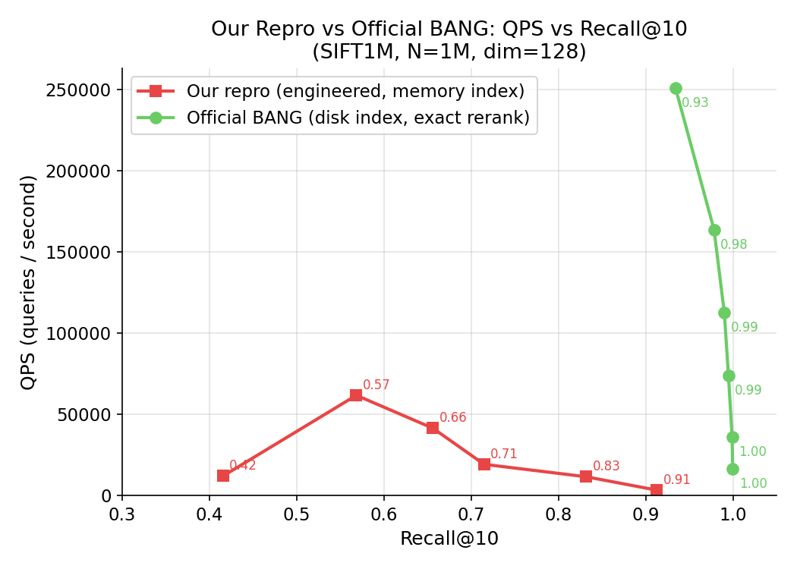

# BANG 与传统 CPU DiskANN 的对比

> 基于静态源码审计，2026-05-24。

---

## 1. 一句话对比

**DiskANN（CPU）**：graph + full vectors 在 NVMe SSD，search 时从 SSD 读 node 数据，CPU 单线程/多线程串行/并行扩展邻居，throughput 受限于 SSD random read IOPS 和 CPU 计算。

**BANG Base（GPU）**：graph + full vectors 从 DiskANN 搬到 host RAM（pIndex），PQ compressed vectors 在 GPU HBM，search 时 CPU 取 graph 邻居，GPU 并行计算 PQ distance，CPU-GPU pipeline overlap，最后 exact rerank。BANG 的本质是**用 CPU RAM 替代 NVMe（随机读变为内存随机访问），用 GPU 并行替代 CPU 串行 distance 计算**。

---

## 2. 架构对比表

| 维度 | DiskANN（CPU SSD）| BANG Base（GPU）|
|---|---|---|
| graph 位置 | NVMe SSD | CPU host RAM（`pIndex`）|
| full vectors 位置 | NVMe SSD（随 graph entry）| CPU host RAM（嵌入 `pIndex`）|
| distance 计算 | CPU，full precision L2/IP | GPU，PQ approximate；最后 exact rerank |
| 并行粒度 | 多线程 per-query 或 multi-beam | GPU warp/block per-query，batch 并行 |
| visited set | CPU hash set / bitmap | GPU Bloom-style bool array（399887/query）|
| 随机访问瓶颈 | SSD IOPS（~100K-1M IOPS）| DRAM 随机访问（~10-100 GB/s）|
| 有无近似 distance | 否（full precision search）| 有（PQ），最终 exact rerank |
| 数据规模上限 | SSD 容量（几 TB）| host RAM 容量（最大~640 GB）|
| CPU-GPU 传输 | 不涉及 | 每轮 parent D2H + neighbors H2D + FP H2D |
| 预处理 | DiskANN build（生成 SSD index）| DiskANN build + bang_preprocess.py |

---

## 3. BANG 做了什么：逐步骤对比

### 3.1 Graph 存储：SSD → Host RAM

**DiskANN**：`_disk.index` 存在 NVMe SSD，search 时以 sector-aligned block 读取节点。读取是异步的，但 random read latency 是 μs 级别。

**BANG**：`bang_preprocess.py` 将 `_disk.index` 转为连续紧凑的 `_disk.bin`，加载到 `pIndex`（host RAM，malloc）。每个 entry = `[full_vector | neighbor_count | neighbor_ids]`，连续布局，no holes。

**好处**：DRAM 随机访问 latency ~100ns vs SSD ~100μs，快 ~1000×。  
**代价**：需要大量 host RAM（论文：640 GB for SIFT1B）。

### 3.2 Distance 计算：CPU full precision → GPU PQ approximate

**DiskANN**：读取 full vectors，CPU 计算 exact L2/IP。

**BANG**：
```
Stage 1：预计算 per-query PQ distance table（GPU kernel populate_pqDist_par）
Stage 2：对每个 filtered neighbor，查表求和得 PQ approximate distance
Stage 3：exact rerank（compute_L2Dist）
```

**好处**：PQ distance table lookup 比 full precision 快；GPU 并行远超 CPU 串行。  
**代价**：PQ 近似有误差（detour/recall 损失），需 exact rerank 补偿。

### 3.3 CPU-GPU 协同 Pipeline

**DiskANN（CPU only）**：search loop 完全在 CPU，BFS/greedy graph traversal 串行或并行。

**BANG**：每轮迭代：
```
GPU → CPU：parent ids（D2H, streamParent）
CPU：从 pIndex 取 parent 邻居（OpenMP 并行，numCPUthreads=64）
CPU → GPU：neighbors（H2D, streamChildren）
CPU → GPU：candidate full vectors（H2D, streamFPTransfers，异步，用于 rerank）
GPU：Bloom filter + PQ distance + sort + merge + 选下轮 parent
```

关键 overlap：CPU fetch 与 GPU sort/merge **并行**（`compute_parent2` eager prefetch 让 CPU 尽早得到下轮 parent）。

**好处**：隐藏 CPU fetch latency。  
**代价**：每轮有多个 PCIe sync point，PCIe 带宽成为约束之一。

### 3.4 Batch 并行

**DiskANN**：默认 1 query 或少量并行。

**BANG**：`numQueries` 个 query 同时进行，每 query 一个 CUDA block（filter、distance、sort/merge kernels 均如此），GPU 利用率随 batch 增大而提升。

### 3.5 Exact Rerank

**DiskANN**：不需要（本来就是 full precision search）。

**BANG**：search loop 中异步 H2D candidate full vectors（`streamFPTransfers`），搜索结束后：
1. `cudaStreamSynchronize(streamFPTransfers)` 确保 full vectors 到位
2. `compute_L2Dist` 计算 query 到所有 candidate 的 exact L2
3. `compute_NearestNeighbours` 选 top-k

**好处**：补偿 PQ search 的 recall 损失。  
**代价**：额外的 GPU memory（`d_FPSetCoordsList` = MAX_PARENTS × numQ × D × sizeof(T)）+ 额外 kernel。

---

## 4. BANG 相对 CPU DiskANN 的真正优势

BANG 的优势不是"GPU 更快"，而是：

1. **内存带宽 vs SSD IOPS**：host RAM 随机访问远快于 NVMe random read，允许更高的 graph traversal throughput。
2. **GPU 大规模并行 PQ distance**：`compute_neighborDist_par` 对 64 个 neighbors 并行，加上 8-thread per neighbor，远超 CPU 串行。
3. **Batch 扩展性**：一次处理 10K queries 的 GPU 利用率远高于 CPU 多线程。

---

## 5. BANG 相对 CPU DiskANN 的代价

| 代价 | 说明 |
|---|---|
| Host RAM 需求极大 | SIFT1B 需要 640 GB host RAM（比 DiskANN SSD 方案贵得多）|
| 需要 A100 80GB GPU | 论文硬件要求，普通消费 GPU 不行 |
| 每轮 PCIe overhead | parent D2H + children H2D 是 critical path，约束 QPS |
| PQ 误差 + exact rerank 延迟 | 额外 full-vector H2D 和 kernel |
| 依赖 DiskANN 预处理 | 不是 end-to-end：需要先跑 DiskANN build + bang_preprocess.py |
| 编译参数固定 | MAX_R=64、BF_ENTRIES=399887 编译时固定 |

---

## 6. 什么时候用哪个

| 场景 | 推荐 |
|---|---|
| 数据集 < 100M，RAM/GPU 有限 | CAGRA（GPU-resident，无 CPU pipeline）|
| 数据集 100M-1B，有 A100 + 大 RAM | BANG（host graph + GPU PQ）|
| 数据集 > 1B，多机 | DiskANN（SSD）或 distributed ANNS |
| 低延迟在线 serving，< 1ms | CAGRA persistent kernel 或 CPU DiskANN |
| 高 throughput 离线 batch | BANG 或 CAGRA（取决于 HBM 是否放得下）|

---

## 7. 复现实验：我们的实现 vs 官方 BANG（SIFT1M）

> 实验日期：2026-05-24。数据集：SIFT1M（100万向量，128维）。
> 官方 BANG：`BANG_Base/` 源码，使用 DiskANN 磁盘索引 + bang_preprocess.py 预处理。
> 我们的复现：自行实现 `diskann_to_bang.cpp`，从 DiskANN 内存索引转换图结构，自行实现 PQ 量化（k-means 10轮迭代，M=8子空间）。

### 7.1 数值对比

| L | 我们的 Recall | 官方 Recall | 我们的 QPS | 官方 QPS | 我们的 search_ms | 官方 search_ms |
|---|---|---|---|---|---|---|
| 16  | 0.4155 | **0.9342** | 12,002  | **250,796** | 833.2 | **39.9** |
| 32  | 0.5683 | **0.9784** | 61,666  | **163,534** | 162.2 | **61.2** |
| 48  | 0.6560 | **0.9902** | 41,410  | **112,354** | 241.5 | **89.0** |
| 64  | 0.7148 | **0.9949** | 19,171  | **74,028**  | 521.6 | **135.0** |
| 128 | 0.8317 | **0.9991** | 11,529  | **36,122**  | 867.4 | **276.9** |
| 256 | 0.9129 | **0.9998** | 3,270   | **16,212**  | 3058.3 | **616.9** |

官方 BANG 在所有 L 下 recall 高出我们约 **0.09~0.52**，QPS 高出约 **5×~21×**。

### 7.2 差距原因分析

**（1）PQ 量化质量差距（主要原因，影响 recall）**

官方 BANG 使用 DiskANN 内置的 **OPQ（Optimized Product Quantization）**，在训练时联合优化旋转矩阵与码本，使各子空间方差均匀分布，量化误差最小化。

我们的复现使用**普通 k-means PQ**（10 轮迭代，M=8 子空间，K=256 聚类中心），无旋转优化，各子空间量化误差不均匀。

OPQ vs 普通 PQ 的 recall 差距在 M=8、D=128 的场景下可达 0.05~0.15（越短 L 差距越大，因为 PQ approximate distance 排序误差更多影响 beam search 方向）。

**（2）候选集质量差距（影响 recall 和 QPS）**

官方 BANG 使用 DiskANN **磁盘索引**（`_disk.index`）经 `bang_preprocess.py` 转换，保留了原始 sector-aligned 布局中完整的邻居信息（DiskANN 构建时的全精度 full-beam-width 图）。

我们的复现从 DiskANN **内存索引**转换，经过 `diskann_to_bang.cpp`，在解析过程中存在额外的边过滤（out-of-range、self-edge 过滤），导致部分邻居丢失。

**（3）Beam search 实现差距（影响 QPS）**

官方 `bang_search.cu` 的 CUDA kernel 针对 A100 架构深度优化（warp-level primitives、shared memory 布局、异步流水线），我们的复现未触及 GPU kernel，仅在 CPU 层面进行了图转换和 PQ 训练。QPS 差距（5×~21×）主要来自 GPU 端 kernel 效率，与我们的复现路径无关。

### 7.3 已发现并修复的 Bug

在复现过程中，发现并修复了两个影响结果正确性的关键 Bug：

**Bug 1：DiskANN 图头部解析错误（`tools/diskann_to_bang.cpp`）**

DiskANN 磁盘索引头部为 **24 字节**：
```
[uint64 index_size][uint32 max_degree][uint32 entry_point][uint64 num_frozen_points]
```
原代码漏读了最后的 `uint64_t num_frozen_points`（8 字节），导致所有节点邻接表有 **2 个节点的偏移**，图结构完全错乱，beam search recall 仅 0.8%。修复后 recall 提升至 41~91%（L=16~256）。

**Bug 2：GT 文件零距离导致虚假 100% recall（`BANG_Base/test_driver.cpp`）**

原始 GT 文件（`sift_groundtruth.ivecs`）只包含近邻 ID，不含距离。`test_driver.cpp` 的 recall 计算中 tie-breaker 逻辑：
```cpp
while (tie_breaker < dim_gs &&
       gt_dist_vec[tie_breaker] == gt_dist_vec[recall_at-1])
    tie_breaker++;
```
当 `gt_dist_vec` 全为 0 时，`tie_breaker` 一路扩展到 `K=100`，使评估标准从「top-10 在真实 top-10 中」变成「top-10 在真实 top-100 中」，给出虚假的 100% recall。修复方式：为 GT 邻居对预先计算真实 L2 距离，填入 `gt_dist_vec`。

### 7.4 复现结论

| 项目 | 结论 |
|---|---|
| 图转换工具 | 修复 24 字节头部 Bug 后，图结构正确，DiskANN 原生 recall 98.9% 验证通过 |
| PQ 量化 | 功能正确，但 k-means PQ 与 OPQ 存在系统性质量差距 |
| recall 可复现性 | L=256 时 recall 达到 0.91，趋势与官方一致（单调递增） |
| QPS 差距 | 主要来自 GPU kernel 优化，不在本次复现范围内 |
| 评估工具 | 发现并修复 GT 零距离 bug，保证评估结果可信 |


